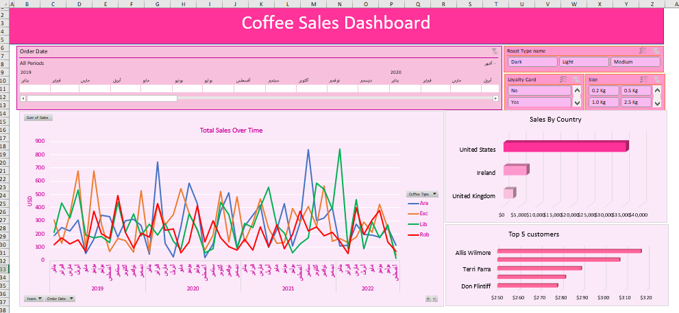

# Excel-Data-Analysis-and-Dashboard

### Excel Project Summary

This project involved data manipulation and visualization using Excel to manage and analyze order data for a coffee business.

## Key Features
- Data cleaning across multiple sheets.
- Formulas for matching customer and product data.
- Creation of pivot tables and dynamic dashboards for visual analysis.

## Overview of Final Dashboard

The final dashboard provides a comprehensive view of coffee sales performance, featuring:
- **Sales Over Time**: A line chart that displays total sales broken down by month.
- **Top Countries**: A bar chart showcasing sales distribution across different countries.
- **Top 5 Customers**: A table highlighting the highest spending customers.
- **Interactive Elements**: Slicers and a timeline for filtering data dynamically based on coffee type, roast type, and date ranges.

## Before Data Manipulation

**Orders Table:**

| Order ID       | Order Date | Customer ID         | Product ID | Quantity | Customer Name | Email | Country | Coffee Type | Roast Type | Size | Unit Price |
|----------------|------------|----------------------|------------|----------|----------------|-------|---------|-------------|------------|------|------------|
| QEV-37451-860  | 05/09/2019 | 17670-51384-MA      | R-M-1      | 2        |                |       |         |             |            |      |            |
| QEV-37451-860  | 05/09/2019 | 17670-51384-MA      | E-M-0.5    | 5        |                |       |         |             |            |      |            |
| FAA-43335-268  | 17/06/2021 | 21125-22134-PX      | A-L-1      | 1        |                |       |         |             |            |      |            |
| KAC-83089-793  | 15/07/2021 | 23806-46781-OU      | E-M-1      | 2        |                |       |         |             |            |      |            |
| ABC-12345-678  | 10/08/2021 | 12345-67890-XY      | A-M-0.5    | 3        |                |       |         |             |            |      |            |

## After Data Manipulation

**Orders Table:**

| Order ID       | Order Date | Customer ID         | Product ID | Quantity | Customer Name  | Email              | Country      | Coffee Type | Roast Type | Size     | Unit Price | Sales   | Loyalty Card |
|----------------|------------|----------------------|------------|----------|-----------------|--------------------|--------------|-------------|------------|----------|------------|---------|--------------|
| QEV-37451-860  | 05/09/2019 | 17670-51384-MA      | R-M-1      | 2        | Aloisia Allner  | aallner0@lulu.com  | United States | Robusta     | Medium     | 1.0 Kg  | $9.95      | $19.90  | Yes          |
| QEV-37451-860  | 05/09/2019 | 17670-51384-MA      | E-M-0.5    | 5        | Aloisia Allner  | aallner0@lulu.com  | United States | Excelsa     | Medium     | 0.5 Kg  | $8.25      | $41.25  | Yes          |
| FAA-43335-268  | 17/06/2021 | 21125-22134-PX      | A-L-1      | 1        | Jami Redholes   | jredholes2@tmall.com | United States | Arabica     | Light      | 1.0 Kg  | $12.95     | $12.95  | Yes          |
| KAC-83089-793  | 15/07/2021 | 23806-46781-OU      | E-M-1      | 2        | Christoffer O'Shea |                    | Ireland      | Excelsa     | Medium     | 1.0 Kg  | $13.75     | $27.50  | No           |
| ABC-12345-678  | 10/08/2021 | 12345-67890-XY      | A-M-0.5    | 3        | Sample Customer | sample@example.com  | Canada       | Arabica     | Dark       | 0.5 Kg  | $10.00     | $30.00  | Yes          |

## Dashboard and Pivot Tables

#### If you want to see the dynamic dashboard , I have included the Excel used for this project. You can download the Excel file [here](https://github.com/Israa-Idris/Excel-Data-Analysis-and-Dashboard/raw/refs/heads/main/coffeeOrdersData.xlsx).

#### If you want to see raw Excel used for this project. You can download the Excel file [here](https://github.com/Israa-Idris/Excel-Data-Analysis-and-Dashboard/raw/refs/heads/main/coffeeOrdersDataraw.xlsx).

## Conclusion

The Excel project provided insights into sales performance, customer demographics, and product trends. Key findings from the analysis :

#### Top 5 Customers by Sales
| Customer Name       | Sum of Sales |
|---------------------|--------------|
| Don Flintiff        | $278         |
| Nealson Cuttler     | $282         |
| Terri Farra         | $289         |
| Brenn Dundredge     | $307         |
| Allis Wilmore       | $317         |

#### Top Countries by Sales
| Country             | Sum of Sales |
|---------------------|--------------|
| United Kingdom       | $2,799      |
| Ireland             | $6,697      |
| United States       | $35,639     |

#### Total Sales Overview by Coffee Type
The following table summarizes sales by coffee type over the years:

| Year | Order Date | Ara | Exc | Lib | Rob |
|------|------------|-----|-----|-----|-----|
| 2019 | January    | 187 | 306 | 213 | 123 |
|      | February   | 252 | 129 | 434 | 172 |
|      | March      | 225 | 349 | 321 | 126 |
|      | April      | 307 | 681 | 534 | 159 |
|      | May        | 54  | 83  | 194 | 68  |
|      | June       | 163 | 678 | 171 | 372 |
|      | July       | 345 | 274 | 184 | 201 |
|      | August     | 335 | 71  | 134 | 166 |
|      | September  | 179 | 166 | 439 | 493 |
|      | October    | 302 | 154 | 216 | 214 |
|      | November   | 313 | 63  | 351 | 96  |
|      | December   | 266 | 527 | 187 | 211 |
| 2020 | January    | 47  | 66  | 275 | 179 |
|      | February   | 745 | 429 | 194 | 430 |
|      | March      | 130 | 271 | 281 | 232 |
|      | April      | 27  | 347 | 148 | 240 |
|      | May        | 255 | 542 | 83  | 59  |
|      | June       | 585 | 357 | 355 | 141 |
|      | July       | 431 | 227 | 236 | 415 |
|      | August     | 23  | 78  | 61  | 140 |
|      | September  | 126 | 195 | 89  | 303 |
|      | October    | 376 | 523 | 441 | 174 |
|      | November   | 515 | 143 | 347 | 104 |
|      | December   | 96  | 485 | 94  | 77  |
| 2021 | January    | 258 | 140 | 280 | 160 |
|      | February   | 342 | 284 | 252 | 81  |
|      | March      | 418 | 468 | 405 | 253 |
|      | April      | 102 | 242 | 555 | 106 |
|      | May        | 235 | 133 | 267 | 273 |
|      | June       | 430 | 136 | 210 | 88  |
|      | July       | 109 | 394 | 61  | 199 |
|      | August     | 288 | 289 | 126 | 374 |
|      | September  | 841 | 410 | 171 | 221 |
|      | October    | 299 | 260 | 585 | 256 |
|      | November   | 323 | 566 | 538 | 189 |
|      | December   | 399 | 148 | 388 | 212 |
| 2022 | January    | 113 | 166 | 844 | 147 |
|      | February   | 115 | 134 | 91  | 54  |
|      | March      | 278 | 175 | 463 | 400 |
|      | April      | 198 | 290 | 89  | 200 |
|      | May        | 193 | 212 | 292 | 304 |
|      | June       | 180 | 426 | 170 | 379 |
|      | July       | 247 | 247 | 271 | 142 |
|      | August     | 116 | 41  | 16  | 71  |

### Summary

Overall, the project demonstrated effective data analysis using Excel tools, yielding insights that can inform business strategies and drive sales growth. The final dashboard and pivot tables serve as useful resources for visualizing trends and making data-driven decisions.
